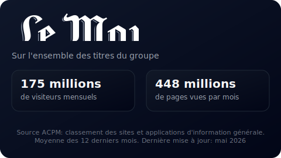

[](https://github.com/TangoMan75/media-pulse/releases/)
[](https://github.com/TangoMan75/media-pulse/releases/)

[](https://github.com/TangoMan75/media-pulse/actions/workflows/ci.yml)
[](https://github.com/TangoMan75/media-pulse/actions/workflows/pulse.yml)


TangoMan Media Pulse
====================


**TangoMan Media Pulse** affiche les audiences des grands titre de presse avec un badge dynamique synchronisé avec les données officielles de l'ACPM. Les badges sont disponibles en deux versions: **dark** ou **light**.

Le Tableau de bord **TangoMan Media Pulse** est disponible ici: [https://tangoman75.github.io/media-pulse](https://tangoman75.github.io/media-pulse)

🚀 Fonctionnalités
------------------

### ⚡ Collecte de données

1. **Extraction ACPM:** Extrait les données de trafic du site ACPM pour les médias français.
2. **Support multi-sites:** Collecte les données pour 
  - [Le Monde](https://www.lemonde.fr) — <small>[acpm](https://www.acpm.fr/les-membres/support/209788754-1-1/lemonde-fr)</small>
  - [Nouvel Observateur](https://www.nouvelobs.com) — <small>[acpm](https://www.acpm.fr/les-membres/support/2195865741-1-1/nouvelobs-com)</small>
  - [Télérama](https://www.telerama.fr) — <small>[acpm](https://www.acpm.fr/les-membres/support/2760865027-1-1/telerama-fr)</small>
  - [Courrier International](https://www.courrierinternational.com) — <small>[acpm](https://www.acpm.fr/les-membres/support/66163995-1-1/courrierinternational-com)</small>
  - [Le Monde Diplomatique](https://www.monde-diplomatique.fr) — <small>[acpm](https://www.acpm.fr/les-membres/support/2826009072-1-1/monde-diplomatique-fr)</small>
3. **Métriques annuelles:** Calcule les pages vues et visites moyennes mensuelles sur les douze derniers mois.
4. **Historique limité:** Le scraper extrait les métriques pour le mois en cours et les ajoute aux données des mois précédents dans la limite de 12.

### ⚡ Automatisation

1. **Exécutions planifiées:** S'exécute automatiquement le 1er de chaque mois à minuit (CRON: `0 0 1 * *`).
2. **Déclenchement manuel:** Utiliser `workflow_dispatch` pour exécuter à la demande depuis l'interface GitHub Actions.
3. **Commit intelligent:** Ne commit que si les données ont changé; ignore les commits redondants.

📡 Documentation API
--------------------

Le scraper génère les données suivantes:

1. **Données JSON:** `docs/stats.json` - Contient les métriques par site (visites moyennes, pages moyennes, horodatages)
2. **Visualisations SVG:** `docs/{site_id}-{theme}.svg` - Représentation graphique des métriques
3. **Analyse de groupe Le Monde:** `docs/lemonde-group-{theme}.svg` - Données combinées pour tous les sites du groupe

exemple:



### 🌐 GitHub Pages

Les résultats générés sont déployés sur _GitHub Pages_ et sont toujours à jour avec les dernières données disponibles:

- **Tableau de bord:** [https://tangoman75.github.io/media-pulse](https://tangoman75.github.io/media-pulse)

Les SVGs générés peuvent être liées directement depuis vos projets:

```html


```

Thèmes SVG disponibles: `-light` (fond clair) et `-dark` (fond sombre).

### ⚙️ Configuration GitHub Pages

Pour fonctionner, le repository doit être configuré de façon à déployer le contenu du dossier `/docs` de la branche `main`

📦 Installation
---------------

1. **Cloner le dépôt:** Cloner le dépôt media-pulse sur votre machine locale.
2. **Installer les dépendances:** Exécuter `npm install` pour installer les dépendances du projet.

🛠️ Utilisation
---------------

1. **Exécuter localement:** Exécuter `npm run scrape` pour extraire les données ACPM.
2. **Consulter les résultats:** Vérifier le répertoire `docs/` pour les fichiers JSON et SVG générés.
3. **GitHub Actions:** Le scraper s'exécute automatiquement selon le planning ou peut être déclenché manuellement.

🖇️ Dépendances / Configuration requise
--------------------------------------

**TangoMan Media Pulse** nécessite les dépendances suivantes:

1. Node.js v22.
2. jsdom (^29.0.2).
3. NPM.

🧪 Stratégie de test
--------------------

1. **Exécuter tous les tests:** Exécuter `npm test` pour exécuter tous les tests unitaires.
2. **Erreurs de syntaxe:** Exécuter `npm run lint` pour vérifier les erreurs de syntaxe.
3. **Vérifier la sortie:** Vérifier les fichiers JSON et SVG générés dans le répertoire `docs/`.
4. **Pipeline CI:** GitHub Actions exécute les tests automatiquement à chaque push sur la branche `main`.

🐛 Limitations
--------------

1. ⚠️ **Latence des données:** Les données ACPM peuvent avoir un retard de plusieurs jours après la fin du mois.
2. ⚠️ **Structure HTML:** Si le site ACPM modifie sa structure HTML, le scraping échouera et nécessitera une mise à jour de `media-pulse.js`.

📝 Notes
--------

Ce projet est conçu pour s'exécuter en tant que GitHub Action avec une planification mensuelle automatique.

🤝 Contribution
---------------

Merci de votre intérêt pour **TangoMan Media Pulse**.

Veuillez consulter le [code de conduite](./CODE_OF_CONDUCT.md) et les [règles de contribution](./CONTRIBUTING.md) avant de commencer à travailler sur des fonctionnalités.

Si vous souhaitez ouvrir un rapport de bug,(https://github.com/%5BTangoMan75%5D/%5Bmedia-pulse%5D/issues) avant d'en créer un nouveau.

📜 Licence
----------

Copyrights (c) 2026 &quot;Matthias Morin&quot; &lt;mat@tangoman.io&gt;

[](LICENSE)
Distribué sous la licence MIT.

Si vous appréciez **TangoMan Media Pulse**, mettez une étoile, suivez-moi ou publiez un tweet.

[](https://github.com/TangoMan75/media-pulse/stargazers)
[](https://github.com/TangoMan75)
[](https://twitter.com/intent/tweet?text=Wow:&url=https%3A%2F%2Fgithub.com%2FTangoMan75%2Fmedia-pulse)

🙏 Mentions Légales
-------------------

- Tous les logos et marques déposées sont la propriété de leurs détenteurs respectifs. Leur utilisation ici est faite à titre purement informatif.
- Source des données de trafic des différents médias français: **[ACPM](https://www.acpm.fr)**
- Logo: **[Google Noto Color Emoji](https://fonts.google.com/noto/specimen/Noto+Color+Emoji):** License [SIL OFL 1.1](http://scripts.sil.org/OFL)

👋 Construisons votre prochain projet ensemble !
------------------------------------------------

À la recherche d'un développeur Full-Stack expérimenté ?

🚀 Je fais décoller vos applications web avec **PHP** et **JavaScript** !

[](https://tangoman.io)